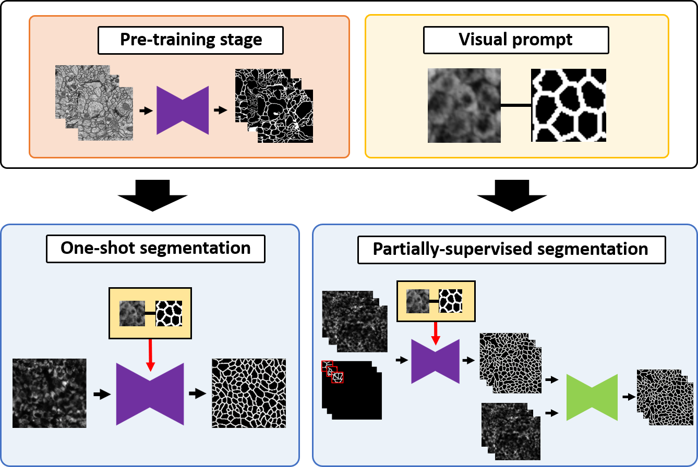
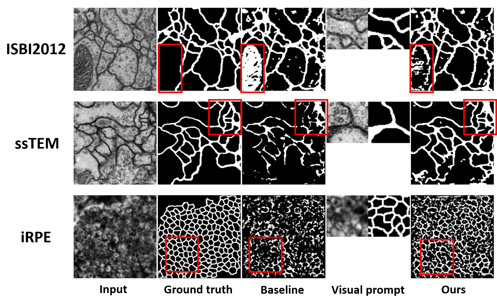
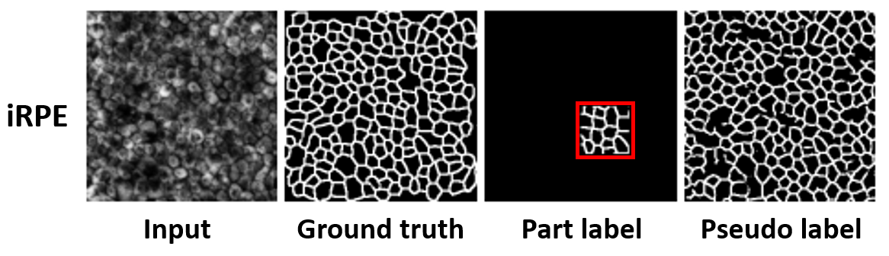

# Oneshot-Part-CellSegmentation
This repository is the official PyTorch implementation ''One-shot and Partially-Supervised Cell Image Segmentation Using Small Visual Prompt'' accepted at CVPR2023: 8th IEEE Workshop on Computer Vision for Microscopy Image Analysis (CVMI) [[paper]](https://openaccess.thecvf.com/content/CVPR2023W/CVMI/papers/Kato_One-Shot_and_Partially-Supervised_Cell_Image_Segmentation_Using_Small_Visual_Prompt_CVPRW_2023_paper.pdf)

## Introduction
<div align="center">
  
</div>
Semantic segmentation of microscopic cell images using deep learning is an important technique, however, it requires a large number of images and ground truth labels for training. 
To address the above problem, we consider an efficient learning framework with as little data as possible, and we propose two types of learning strategies: One-shot segmentation which can learn with only one training
sample, and Partially-supervised segmentation which assigns annotations to only a part of images. 
Furthermore, we introduce novel segmentation methods using the small prompt images inspired by prompt learning in recent studies. 
Our proposed methods use a pre-trained model based on only cell images and teach the information of the prompt pairs to the target image to be segmented by the attention mechanism, which allows for efficient learning while reducing the burden of annotation costs. Through experiments conducted on three types of microscopic cell image datasets, we confirmed that the proposed method improved the Dice score coefficient (DSC) in comparison with the conventional approaches.
<br />
<br />

## Preparation for preprocessing datasets
Coming soon...

## Training
If you prepared the dataset, you can directly run the following code to train the model.
```
sh train.sh
```

## Testing
If you generated the pretrain model, you can run the following code to evaluate the model.
```
sh test.sh
```

## Results and Visualization
### One-shot learning
<div align="center">
  
</div>

### Partially-supervised learning
<div align="center">
  
</div>

## Citation
```
@inproceedings{kato2023one,
  title={One-shot and Partially-Supervised Cell Image Segmentation Using Small Visual Prompt},
  author={Kato, Sota and Hotta, Kazuhiro},
  booktitle={Proceedings of the IEEE/CVF Conference on Computer Vision and Pattern Recognition},
  pages={4294--4303},
  year={2023}
}
```
